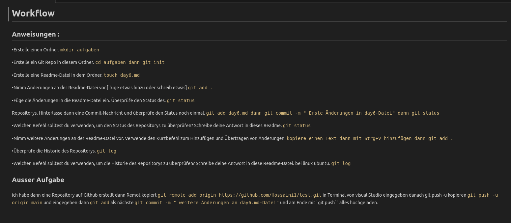

 ----------------------------------------------------------------------------------------
**Hier kann man Code kopieren** :point_down:

# Workflow
## Anweisungen : 
•Erstelle einen Ordner. `mkdir aufgaben`

•Erstelle ein Git Repo in diesem Ordner. `cd aufgaben dann git init`

•Erstelle eine Readme-Datei in dem Ordner. `touch day6.md`

•Nimm Änderungen an der Readme-Datei vor.[ füge etwas hinzu oder schreib etwas] `git add .`

•Füge die Änderungen in die Readme-Datei ein. Überprüfe den Status des. `git status`

Repositorys. Hinterlasse dann eine Commit-Nachricht und überprüfe den
Status noch einmal. `git add day6.md dann git commit -m " Erste Änderungen in day6-Datei" dann git status`

•Welchen Befehl solltest du verwenden, um den Status des Repositorys zu
überprüfen? Schreibe deine Antwort in dieses Readme. `git status`

•Nimm weitere Änderungen an der Readme-Datei vor. Verwende den 
Kurzbefehl zum Hinzufügen und Übertragen von Änderungen. `kopiere einen Text dann mit Strg+v hinzufügen dann git add .`

•Überprüfe die Historie des Repositorys. `git log `

•Welchen Befehl solltest du verwenden, um die Historie des Repositorys 
zu überprüfen? Schreibe deine Antwort in diese Readme-Datei. bei linux ubuntu. `git log `

## Ausser Aufgabe 
ich habe dann eine Repository auf Github erstellt dann Remot kopiert `git remote add origin https://github.com/Hossaini1/test.git` in Terminal von visual Studio eingegeben danach git push -u kopieren `git push -u origin main` und eingegeben dann `git add`  als nächste `git commit -m " weitere Änderungen an day6.md-Datei"` und am Ende mit `git push`` alles hochgeladen.

