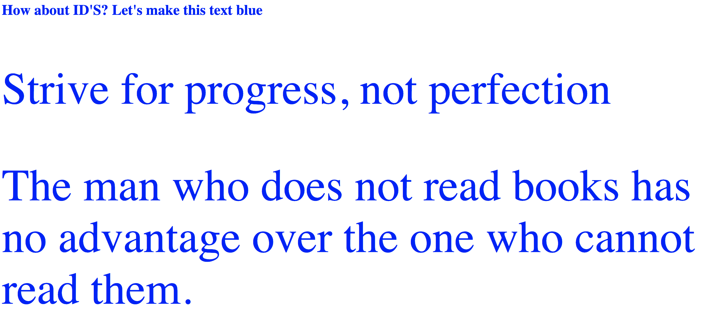

# Wie sieht es mit IDs aus?

**Anleitung**
Ändere die CSS-Datei so, dass der gesamte Text auf der Seite in Blau angezeigt wird. Verwende dafür mindestens eine Klasse und ein ID-Attribut.

**Bonus**

- Verbessere das HTML, indem du alle DIV-Elemente entfernst
- Füge unterschiedliche Hintergrundfarben für den Kopf- und Hauptteil ein
